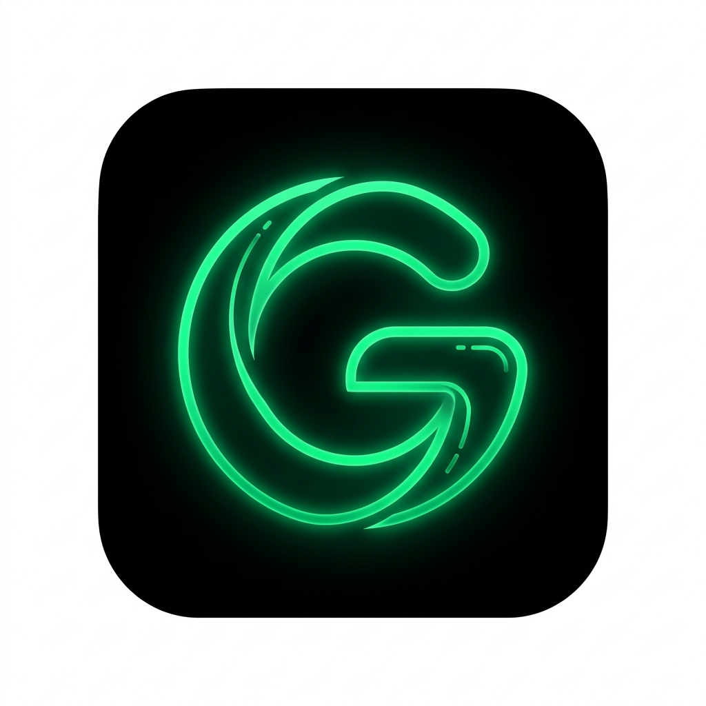

# Ggram — Премиальный форк клиента Telegram

<p align="center">
  
</p>

<p align="center">
  <b>Ggram</b> — мощный, конфиденциальный и ультра-кастомизируемый форк Telegram, вдохновленный кибер-эстетикой глубокого черного (<code>#050505</code>) и электрического изумрудного (<code>#01ba53</code>).
</p>

<p align="center">
  
  
  
  
</p>

---

## ⚡ Ключевые возможности

### 🛡️ 100% Блокировка рекламы (AdBlock Engine)
- **Удаление спонсорских сообщений Telegram:** Полная фильтрация `TL_messages_sponsoredMessages` на уровне сетевого протокола MTProto в публичных каналах.
- **Эвристический фильтр рекламных постов:** Автоматическое обнаружение и сокрытие рекламных публикаций в каналах (по меткам `#реклама`, `#ad`, `erid`, рекламным ботам).
- **Подавление промо-контента:** Отключение навязчивых баннеров Telegram Premium, предложений покупки Telegram Stars и подарков.

### 👻 Режим невидимки (Ghost & Privacy Suite)
- **Скрытое чтение (Ghost Read):** Читайте сообщения без отправки галочек прочтения собеседнику.
- **Прочтение только при ответе (Read on Reply):** Сообщения отмечаются прочитанными только тогда, когда вы сами отправляете ответ в диалог.
- **Скрытый ввод (Typing Stealth):** Блокировка статусов «печатает...», «записывает голосовое...» и отправки файлов.
- **Вечный Офлайн (Offline Status Lock):** Ваш аккаунт всегда отображается офлайн без обновления времени последнего визита.
- **Анонимный просмотр историй (Stories Ghost):** Просматривайте истории без появления вашего профиля в списке зрителей.
- **Защита от случайных действий:** Подтверждающие диалоги перед отправкой голосовых сообщений, видеокружочков, стикеров и вызовов.

### 💾 Сохранение сообщений (Anti-Recall & Message Spy)
- **Сохранение удаленных сообщений:** Удаленные собеседником сообщения не исчезают из локальной базы данных, а помечаются ярким красным бейджем `[Удалено]` с отметкой времени.
- **История редактирования сообщений:** Сохранение всех версий правок в чате с интерактивным просмотром различий `[Изм.]`.
- **Сохранение самоуничтожающихся медиа:** Автоматическое копирование фото и видео с таймером в локальное защищенное хранилище.

### 🔓 Обход ограничений (Restrictions Bypass)
- **Разрешение скриншотов:** Снятие системного флага `FLAG_SECURE` — возможность делать скриншоты и видеозапись экрана в секретных чатах и каналах.
- **Снятие защиты от копирования (`noforwards`):** Разрешено копирование текста, пересылка сообщений и сохранение медиа в галерею из каналов с запретом от автора.

### 🎨 Ультра-кастомизация интерфейса (Ggram Obsidian & Emerald)
- **Фирменная цветовая схема:**
  - Базовый фон: `#050505` (глубокий черный Obsidian).
  - Элементы и карточки: `#0c0f0d` / `#121814`.
  - Неоновый изумрудный акцент: `#01ba53` / `#00e664`.
- **Нижняя панель навигации (Bottom Navigation Bar):** Возможность переключения между классическим боковым меню (Drawer) и быстрым нижним баром.
- **Настройка пузырей сообщений:** Кастомизация радиуса скругления углов сообщений.
- **Отображение DC и Telegram ID:** Быстрый просмотр номера датацентра и ID в профиле любого пользователя или канала.
- **Неограниченное закрепление:** Снятие лимита на количество закрепленных диалогов.

---

## 📁 Структура проекта

```
GR3EN_Telegram_app/
├── app/
│   ├── src/main/
│   │   ├── java/org/ggram/
│   │   │   ├── GgramApp.kt                      # Точка входа приложения и регистрация хуков
│   │   │   ├── config/GgramConfig.kt            # Менеджер настроек SharedPreferences
│   │   │   ├── adblock/GgramAdBlocker.kt        # Модуль фильтрации рекламы и спонсоров
│   │   │   ├── ghost/GgramGhostController.kt    # Режим невидимки и подтверждения действий
│   │   │   ├── antirecall/GgramAntiRecallManager.kt # Сохранение удаленных сообщений и правок
│   │   │   ├── bypass/GgramRestrictionBypass.kt # Снятие FLAG_SECURE и запрета копирования
│   │   │   ├── ui/GgramUICustomizer.kt          # Динамическая темизация и стили
│   │   │   ├── ui/preferences/GgramPreferencesActivity.kt # Интерактивный экран настроек
│   │   │   └── ui/diff/GgramDiffActivity.kt     # Просмотр истории изменений
│   │   ├── res/                                 # Векторные ассеты, макеты, темы, цвета
│   │   └── assets/ggram_dark.attheme            # Импортируемая тема Ggram для Telegram
├── art/
│   └── ggram_logo_512.png                       # Фирменный логотип 512x512
├── build.gradle                                 # Корневой скрипт сборки Gradle
├── settings.gradle
└── README.md
```

---

## 🛠️ Сборка и запуск

Проект собирается с помощью Gradle и Android SDK (минимальная версия Android 8.0 Oreo, API 26; целевая — Android 14, API 34).

```bash
# Клонирование репозитория
git clone https://github.com/grigfox43-hash/Ggram.git

# Переход в директорию
cd Ggram

# Сборка Debug APK
./gradlew assembleDebug
```

---

## 📜 Лицензия
Ggram распространяется под лицензией **GNU General Public License v3.0 (GPL-3.0)** в соответствии с лицензией Telegram.
